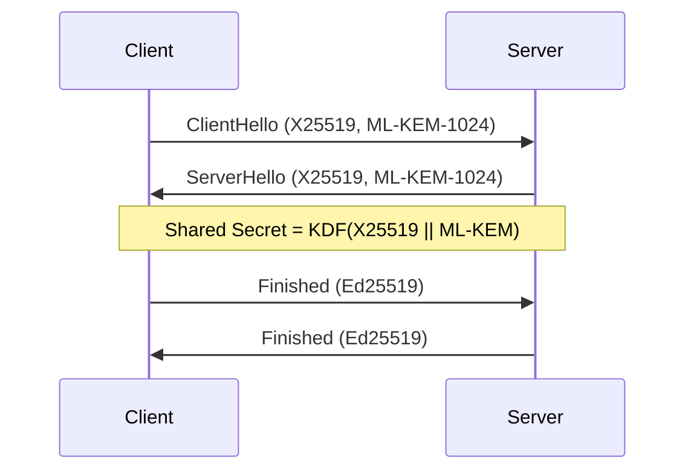

# Erebos — Kryptographie

## Handshake (X25519 + ML-KEM-1024 + Ed25519)
Hybrid aus klassischer und Post-Quantum-Kryptographie.

```mermaid
sequenceDiagram
    participant C as Client
    participant S as Server
    C->>S: ClientHello (X25519, ML-KEM-1024)
    S->>C: ServerHello (X25519, ML-KEM-1024)
    Note over C,S: Shared Secret = KDF(X25519 || ML-KEM)
    C->>S: Finished (Ed25519)
    S->>C: Finished (Ed25519)
```
